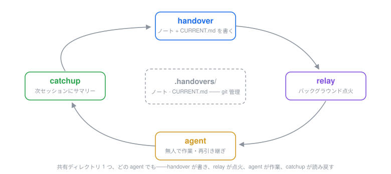

# quiver

> 一本の矢、一つのスキル。🏹
> **小さく、鋭く、独立——どのエージェントでも同じ矢。**

[](https://github.com/dudupii/quiver/actions/workflows/check.yml)
[](https://github.com/dudupii/quiver/releases)
[](./LICENSE)
[](https://github.com/dudupii/quiver/stargazers)

[English](README.md) · [简体中文](README.zh-Hans.md) · [繁體中文](README.zh-Hant.md) · [日本語](README.ja.md)

<p align="center"></p>

AI コーディングエージェント向けの、成長し続けるスキルの矢筒——[Claude Code](https://claude.com/claude-code)、[Codex](https://developers.openai.com/codex/)、[pi](https://pi.dev/)、[PrimeAgent](https://github.com/PrimeIntellect-ai/prime-agent)(その他の pi 互換エージェントも同様に)。どの矢も小さく、鋭く、独立——必要なものだけ引き抜く。

スキルの単一ソース + 各エージェント向けの薄いアダプター:すべてのエージェントが、このリポジトリから同じ矢を受け取ります。

多くのスキルパックはフレームワークを届けます——セッションフック、段階的なワークフロー、あらゆるタスクに巻くプロセス。quiver は逆を行きます:矢は SKILL.md 1 枚——最大でも数 KB、フックなし、エージェントが持っている以上のハーネスもなし。常時コストはスキル一覧の数十トークンだけ。残りは、放つまで待機します。

## 矢

| スキル | できること |
|---|---|
| **brainstorm** | 実装が始まる**前に**、曖昧なアイデアを合意済みのデザインへ整理する。創造的な作業の始まりで自動発火。 |
| **handover** | 多言語のセッション引き継ぎノート(en / ja / zh)+ 言語メモリ——決定、捨てた選択肢、ハマりどころ、次のステップ、推奨スキル——に加え、事実 1 行 1 条の現状ファイル `CURRENT.md` をノートの蓄積とともに新鮮に保つ。 |
| **catchup** | 最新の引き継ぎノート(+最後のノート以降のコミット)を読み、4 セクションのサマリーで応える。厳密に読み取り専用で、自動発火しても安全。 |
| **relay** | 最新の引き継ぎノートを種に、真新しいバックグラウンド agent が無人で作業を引き継ぐ——ポインタの種、記述的な名前、コマンドのエコーバック。ユーザー明示のみ。 |

今後も矢は増えます。

## インストール

**Claude Code**

```bash
claude plugin marketplace add dudupii/quiver
claude plugin install quiver@quiver
```

すべての矢がまとめてインストールされ、`/quiver:` 名前空間に登録——裸名(`/brainstorm`、`/handover`)も使えます。

**Codex**

```bash
codex plugin marketplace add dudupii/quiver
codex plugin add quiver@quiver
```

スキルは `quiver:brainstorm`、`quiver:catchup`、`quiver:grilling` としてカタログに現れます。`handover` と `relay` は意図的に自動カタログへ載せません(明示的に頼んだときだけ発火)。

**pi**

```bash
pi install git:github.com/dudupii/quiver
```

`pi install git:github.com/dudupii/quiver@v0.5.0` でリリースをピンできます。

**PrimeAgent**(pi 上に構築、同じパッケージ形式)

```bash
prime-agent package install git:github.com/dudupii/quiver
```

## アップデート

| エージェント | コマンド |
|---|---|
| Claude Code | `claude plugin update quiver`——再起動で適用。バージョンが古いままなら先にマーケットプレイスを更新(`claude plugin marketplace update quiver`) |
| Codex | `codex plugin marketplace upgrade quiver` の後、`codex plugin add quiver@quiver` で再インストール |
| pi | `pi update` |
| PrimeAgent | `prime-agent package update` |

## 矢: handover

セッションの締めに生成される引き継ぎノート。人間が(次のセッションが)そのまま拾えるものです。

- **8 個の固定セクション**、最重要は「捨てた選択肢とその理由」——次のセッションが決着済みの議論を再開するのを止める
- **参照、複製しない**:spec、計画、ADR、issue、コミット、diff、以前の引き継ぎにすでにある内容はパスでリンクし、決してコピーしない
- **推奨スキル**:次のセッションがどのスキルを、何に呼ぶべきかを明示
- **秘匿化**:ノートに API キー、トークン、パスワード、個人データは書かない——書き込み前に資格情報パターンの機械走査を毎回実行
- **言語**:`/quiver:handover` はあなたのメッセージから言語を推測(フォールバックは英語)。`/quiver:handover ja` / `/quiver:handover zh` で明示指定——裸の `/handover` でも可。明示した選択は `.handovers/.lang` にプロジェクト単位で記憶され、次回のデフォルトになる
- **フォーカス**:言語トークンの後ろ全部(引数が言語で始まらない場合は引数全体)が、次のセッションの集中点を指定する(`/quiver:handover ja リリースの詰め`、`/handover ログインバグの修正`)。取捨ではなく配分:8 セクションは必ず全部書き、フォーカスされた糸に深さと次ステップの先頭を与え、他は要点へ収束
- ノートは `.handovers/YYYY-MM-DD_HHmm.md` に置かれる(名前衝突は `_2`、`_3` …)。先頭には YAML frontmatter:`author`(git の `user.name` のみ——email は絶対に書かない)、`branch`、`commit`、`lang`、前のノートへ繋ぐ `continues:`。取得できない項目は黙って省略。この慣習より前のノートもそのまま有効
- **ユーザー明示のみ**:handover が独りでに発火することはない——セッションが終わること自体はトリガーではない。あなた(または次のセッションの人間)が頼まなければならない
- **旧パス**:v0.4.0 より前のノートは `.claude/handovers/` にある——引き続き読まれる(`continues`、catchup、言語メモリ)が、書き換えられることは決してない。新しいノートは必ず `.handovers/` へ
- **現状ファイル**:ノートと並行して、handover は `.handovers/CURRENT.md` を維持する——耐久的な事実 1 行 1 条、最新の状態のみ、確認日付とソースノート付き。各実行はそのセッションが学んだことだけを適用する:新しく確定した事実は追加、真実が変わった項目はその場で置換(項目は新事実のみを述べる——古い値は git とソースノートが保持する)、反証されたものは削除、セッションが触れていない項目は決して書き換えない。ノートが存在するのに `CURRENT.md` がないリポジトリでの初回実行は、全履歴から最古のノート順にブートストラップする——古さに埋もれた事実が新しいノートに押し出されないように
- **クロージングレシート**:handover の締めの返信がそのままレシートになる——ノートのパス、書き込んだメタデータのチェーン(ノート自身の frontmatter 規則に従う)、そして `CURRENT.md` の結果(変更を各 1 行)。ブートストラップ時は条目数から始めて全追加を列挙。何かが黙って書き込まれることはない
- **git 対応・git 読み取り専用**:引き継ぎディレクトリが git 管理のとき、ノートをコミットしてチームメイトに見せるよう締めに 1 行だけ提案する。無視されているか未追跡なら、git には一切触れない。状態を変える git コマンドは決して実行しない

## 矢: catchup

handover の読み取り側。`/quiver:catchup`(裸の `/catchup` も可)は最新の引き継ぎノートを読む——デフォルト 3 本、数字で広げられる(`/catchup 5`)——4 セクションのサマリーで応える:**現在の状態 / 開いている糸口と次の一歩 / 今も有効なハマりどころ / 推奨アクション**。最新ノートが `commit` を記録していれば、そこからの git log もサマリーに折り込む——「最後の引き継ぎの後に何が起きたか」が同じコマンドで分かる。`.handovers/CURRENT.md` が存在するときは catchup が先にそれを読む——耐久的な事実を確認日付付きで——それから最新ノートと同じ日付のノート全部(同日の並行引き継ぎも込み)。ない場合は従来どおり 3 本ウィンドウ。

モデル発火を許している——書き込みを一切しない(言語メモリにすら触れない)厳密な読み取り専用だから、引き継ぎノートのあるプロジェクトでセッションが始まるとき、自ら発動して構わない。frontmatter のない旧形式のノートもそのまま読む。

## 矢: relay

handover の点火側。`/quiver:relay [フォーカス]`(裸の `/relay` も可)は**最新の**引き継ぎノートを、このマシンの真新しいバックグラウンド agent に渡す:種はポインタ——「このノートを読み、catchup を走らせ、この糸口を追え」——であって、ノートのコピーではない。agent は記述的な名前(フォーカスか、ノートの最優先ネクストステップから派生)で現在の作業ディレクトリに起動し、ジョブ一覧とターミナルタイトルで一目で分かる。確かな起動コマンドは返信にエコーされる。フォーカスで糸口を指定でき、省略時はノートの最優先ネクストステップ。

- **ユーザー明示のみ**——バックグラウンドプロセスの起動は副作用なので、relay が独りでに発火することはない。明示のみの文言は全プラットフォームが読むスキル説明に乗っており、各アダプターのポリシーでも宣言される
- **書き込みゼロ**:ノートはバイト単位で不変(`.lang` 含む)、git は読み取り専用——点火が relay の唯一の副作用
- **ノートがない?** relay は拒否して `/quiver:handover` を指し示す——種を捏造することはない
- **プラットフォーム対応**——各プラットフォームの CLI とドキュメントに対して検証済み。機構のないプラットフォームでは、点火できたふりをせず正直に伝える:

  | プラットフォーム | バックグラウンド機構 | relay の挙動 |
  |---|---|---|
  | Claude Code | ネイティブ(`claude --bg`) | そのまま点火。ジョブ一覧で管理 |
  | Codex CLI | ローカルにはなし——`exec` はフォアグラウンド、`queue` は既存セッション向け、`agents` は閲覧のみ | 正直に報告。種を渡して第 2 ターミナルで実行、または Codex Cloud 利用なら実験的な `codex cloud exec` |
  | pi | コアには意図的になし——公式は「tmux 経由で起動」 | tmux で 2 台目の pi(`pi -p`)を起動、またはインストール済みのサブエージェント拡張に従う |
  | PrimeAgent | ネイティブ——daemon 支えの常駐セッション | 常駐セッションを起動(`rlm.create_session`)。`prime-agent agents` で管理 |
- これで閉じるループ:handover が書く → relay が無人の agent を点火 → agent が作業する(そしてまた handover を書く)→ catchup が成果を読み戻す

## チームでの運用

引き継ぎディレクトリが共有媒体になります:

1. **`.handovers/` を git 管理にする。** 全員のセッションが同じディレクトリに書く——どの agent を使っていても(Claude Code、Codex、pi …)。handover はディレクトリが追跡されていることを検知し、各ノートのコミットを提案——1 行だけ。スキル自体は git 状態に決して触れない。
2. **ノートの言語を 1 つに決める。** `.handovers/.lang` はプロジェクトに 1 つの共有値(後書き勝ち)。`/quiver:handover zh`(または `ja` / `en`)で一度設定すれば、全員のノートがそれに続く。
3. **セッションの頭で `/quiver:catchup` を走らせる。** 最新ノートと、それ以降のコミット——コマンド 1 回で文脈が復元され、古い情報を鵜呑みにしない。

## 矢: brainstorm

`superpowers:brainstorming` の軽量代替:重いプロセスフレームワークなし、セッション開始フックなし、全タスクへの強制ワークフローなし。入口スキル 1 つとインタビューエンジン 1 つ、合計約 2KB の指示。

### 仕組み

1. **発散フェーズ**(必要なとき)——方向性レベルの決定(新サブシステム、外部依存の選定、データモデルの変更、同期 vs 非同期)、あるいはあなたが選択肢を求めるとき、まず全体設計の 2–3 案をトレードオフと推奨付きで示し、**あなたが選ぶのを待つ**。
2. **収束フェーズ**——[grilling](https://github.com/mattpocock/skills)(バンドル、MIT)を実行:デザインツリー型インタビュー。依存順に、ラウンドごとにバッチで質問し、各質問に推奨答案を付ける。自分で調べられることは決して聞かない。
3. **ゲート**——整合が取れたらデザインサマリー(各決定の代替/選択/理由 + 未決の仮定)を渡す。**あなたが良いと言うまで、何も実装されない。**

### 使い方

```
ログシステムにアラートルールエンジンを追加したい          ← 自動発火
キャッシュ層の選択肢を 2-3 個比較して                    ← 発散フェーズを強制
先に整合を取ろう:CLI に OAuth ログイン                   ← 明示
```

[mattpocock skills](https://github.com/mattpocock/skills) も使っているなら、`/to-spec` → `/to-tickets` → `/implement` へ自然につながる。利用可能ならスキルが提案する。

### superpowers:brainstorming との比較

| | superpowers:brainstorming | quiver/brainstorm |
|---|---|---|
| トリガー | あらゆる創造的タスク前に強制 | 自動だが段階別。方向性レベルのみ発散 |
| 質問 | 一度に 1 問 | デザインツリーでラウンド制、依存順、バッチ、各問に推奨付き |
| 選択肢比較 | 常に 2–3 案 | 決定が方向性レベルのとき、またはあなたが求めたとき |
| 常駐コスト | フレームワーク全体で ~741 トークン/セッション | 一覧は約 60 トークン、発火までゼロ |
| ゲート | スキル内のプロンプトで拘束 | あなたが門番。ネイティブの plan mode と組み合わせればハーネスレベルの硬いゲート |

## クレジットとライセンス

- `skills/grilling/` にバンドルされた `grilling` エンジンは Matt Pocock の [mattpocock/skills](https://github.com/mattpocock/skills) から——MIT。[THIRD_PARTY_NOTICES.md](THIRD_PARTY_NOTICES.md) を参照。
- その他すべて:MIT © 2026 dudupii——[LICENSE](LICENSE) を参照。
