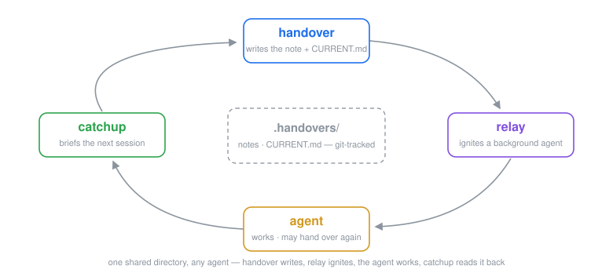

# quiver

> One arrow, one skill. 🏹
> **Small, sharp, independent — and the same arrows on every agent.**

[](https://github.com/dudupii/quiver/actions/workflows/check.yml)
[](https://github.com/dudupii/quiver/releases)
[](./LICENSE)
[](https://github.com/dudupii/quiver/stargazers)

[English](README.md) · [简体中文](README.zh-Hans.md) · [繁體中文](README.zh-Hant.md) · [日本語](README.ja.md)

<p align="center"></p>

A growing quiver of skills for AI coding agents — [Claude Code](https://claude.com/claude-code), [Codex](https://developers.openai.com/codex/), [pi](https://pi.dev/), and [PrimeAgent](https://github.com/PrimeIntellect-ai/prime-agent) (pi-compatible agents generally). Small, sharp, and independent — grab only what you need.

One source of skills, thin per-agent adapters: every agent gets the same arrows from this one repo.

Most skill packs ship a framework — session hooks, staged workflows, a process wrapped around every task. quiver inverts that: an arrow is a single SKILL.md — a couple of KB at most, no hooks, no harness beyond what your agent already has. The only standing cost is a few dozen tokens of skill listing; everything else waits until you fire.

## Arrows

| Skill | What it does |
|---|---|
| **brainstorm** | Turns a rough idea into an agreed design *before* any implementation. Auto-triggers at the start of creative work. |
| **handover** | Multilingual session handover notes (en / ja / zh) with language memory — decisions, discarded options, gotchas, next steps, suggested skills — plus `CURRENT.md`, a one-line-per-fact current-state file that stays fresh as the notes accumulate. |
| **catchup** | Reads the latest handover notes (plus the commits since the last one) and briefs you in four sections. Strictly read-only, safe to auto-trigger. |
| **relay** | Hands the latest handover note to a fresh background agent that picks up the work unattended — pointer seed, descriptive name, echoed command. User-requested only. |

More arrows coming.

## Install

**Claude Code**

```bash
claude plugin marketplace add dudupii/quiver
claude plugin install quiver@quiver
```

All arrows install together, namespaced under `/quiver:` — and bare names work too (`/brainstorm`, `/handover`).

**Codex**

```bash
codex plugin marketplace add dudupii/quiver
codex plugin add quiver@quiver
```

Skills appear in the session catalog as `quiver:brainstorm`, `quiver:catchup`, `quiver:grilling`; `handover` and `relay` stay out of the automatic catalog on purpose (they fire only when you ask for them).

**pi**

```bash
pi install git:github.com/dudupii/quiver
```

Pin a release with `pi install git:github.com/dudupii/quiver@v0.5.0`.

**PrimeAgent** (built on pi, same package format)

```bash
prime-agent package install git:github.com/dudupii/quiver
```

## Update

| Agent | Command |
|---|---|
| Claude Code | `claude plugin update quiver` — restart the session to apply; refresh the marketplace first (`claude plugin marketplace update quiver`) if the version looks stale |
| Codex | `codex plugin marketplace upgrade quiver`, then reinstall via `codex plugin add quiver@quiver` |
| pi | `pi update` |
| PrimeAgent | `prime-agent package update` |

## Arrow: handover

A session-end handover note that a human (or the next session) can pick up.

- **8 fixed sections**, most importantly *Discarded options and why* — it stops the next session from re-litigating settled questions
- **Reference, don't duplicate**: content already captured in specs, plans, ADRs, issues, commits, diffs or earlier handovers is linked by path, never copied
- **Suggested skills**: names which skills the next session should invoke, and for what
- **Redaction**: no API keys, tokens, passwords or personal data in the note — a mechanical credential scan runs before every write
- **Language**: `/quiver:handover` infers the language from your messages (English fallback); `/quiver:handover ja` / `/quiver:handover zh` set it explicitly — bare `/handover` works too. An explicit choice is remembered per project in `.handovers/.lang` and becomes the default for the next run
- **Focus**: whatever follows the language token — or the whole argument when it doesn't start with one — tells the note what the next session will concentrate on (`/quiver:handover zh finalize the release`, `/handover fix login bug`). Emphasis, not selection: all eight sections are still written, the focused thread gets the depth and the top next-steps, everything else condenses to essentials
- Notes land in `.handovers/YYYY-MM-DD_HHmm.md` (name collisions get `_2`, `_3`, …), each starting with YAML frontmatter: `author` (git `user.name` only — never an email), `branch`, `commit`, `lang`, and `continues:` linking to the previous note. Fields are silently omitted where unavailable; notes from before this convention still work
- **User-requested only**: handover never fires on its own — a session merely ending is not a trigger; you (or the next session's human) have to ask for it
- **Legacy path**: notes written before v0.4.0 live in `.claude/handovers/` — they are still read (for `continues`, catchup, and the language memory) but never rewritten; new notes always go to `.handovers/`
- **Current-state file**: alongside the note, handover maintains `.handovers/CURRENT.md` — one line per durable fact, latest state only, with its confirmation date and source note. Each run applies only what the session learned: newly durable facts are added, entries whose truth changed are superseded in place (the entry then states the new fact only — the old value lives in git and the source note), refuted ones are deleted, and entries the session didn't touch are never rewritten. A first run in a repo with notes but no `CURRENT.md` bootstraps it from the full history, oldest notes first, so facts buried by age are not crowded out by recent ones
- **Closing receipt**: handover's closing reply doubles as a receipt — the note path, the metadata chain it wrote (deferring to the note's own frontmatter rules), and the `CURRENT.md` outcome, changes one line each; a bootstrap leads with the entry count and lists every added entry. Nothing lands silently
- **Git-aware, git-read-only**: when the handover directory is tracked in git, handover closes with a one-line suggestion to commit the note so teammates see it; when it's ignored or untracked, it says nothing about git. It never runs a state-changing git command

## Arrow: catchup

The read side of handover. `/quiver:catchup` (bare `/catchup` works too) reads the latest handover notes — default 3, widen with a number (`/catchup 5`) — and replies with a four-section brief: **current state / open threads and next steps / active gotchas / suggested actions**. When the newest note records a `commit`, the brief also folds in the git log since that commit, so "what happened after the last note" is answered in the same command. When `.handovers/CURRENT.md` exists, catchup reads it first — every durable fact with its confirmation date — then all notes sharing the newest note's date (same-day parallel handoffs included); without it, the default 3-note window applies unchanged.

It is model-invocable — it can trigger on its own when a session starts or takes over work in a project that has handover notes — because it is strictly read-only: it writes nothing anywhere, not even the language memory. Legacy notes without frontmatter are read like any other.

## Arrow: relay

The ignition side of handover. `/quiver:relay [focus]` (bare `/relay` works too) hands the **latest** handover note to a brand-new background agent on this machine: the seed is a pointer — "read this note, run catchup, pursue this thread" — never a copy of the note. The agent starts in the current working directory with a descriptive name (derived from the focus or the note's top next step) that you will see in the job list and terminal title; the exact launch command is echoed in the reply. An optional focus picks the thread; the default is the note's top-priority next step.

- **User-requested only** — spawning a background process is a side effect, so relay never fires on its own; the explicit-only wording rides the skill description every platform reads, and is declared in each adapter policy
- **Zero writes**: notes stay byte-identical (`.lang` included), git stays read-only — the launch is relay's only side effect
- **No note?** relay refuses and points at `/quiver:handover` — it never invents a seed
- **Platform support** — verified against each platform's own CLI and docs; where a platform has no mechanism, relay says so instead of faking a launch:

  | Platform | Background mechanism | What relay does |
  |---|---|---|
  | Claude Code | Native (`claude --bg`) | Launches; managed from the job list |
  | Codex CLI | None local — `exec` is foreground; `queue` feeds existing sessions, `agents` browses them | Reports it; hands you the seed for a second terminal, or the experimental `codex cloud exec` if you use Codex Cloud |
  | pi | None in core by design — the documented path is "spawn Pi instances via tmux" | Spawns a second pi under tmux (`pi -p`), or defers to an installed subagents extension |
  | PrimeAgent | Native — daemon-backed resident sessions | Spawns a resident session (`rlm.create_session`); managed with `prime-agent agents` |
- The loop it completes: handover writes → relay ignites an unattended agent → the agent works (and may hand over again) → catchup reads the results back

## Team workflow

The handover directory is the sharing medium:

1. **Track `.handovers/` in git.** Everyone's sessions write notes into the same directory — whatever agent they drive (Claude Code, Codex, pi, …). Handover notices the directory is tracked and suggests committing each note — one line; the skill itself never touches git state.
2. **Agree on one note language.** `.handovers/.lang` is a single shared value per project (last write wins). Set it once with `/quiver:handover zh` (or `ja` / `en`) and everyone's notes follow.
3. **Start sessions with `/quiver:catchup`.** Latest notes plus the commits since the newest one — context rehydrated in a single command, with nothing stale trusted blindly.

## Arrow: brainstorm

A lightweight alternative to `superpowers:brainstorming`: no heavyweight process framework, no session-start hooks, no forced workflow on every task. One entry skill and one interview engine, ~2KB of instructions total.

### How it works

1. **Divergent phase** *(when warranted)* — for direction-level decisions (new subsystem, external dependency choice, data model change, sync vs async), or when you ask for options, it first presents 2–3 whole-design approaches with trade-offs and a recommendation, then **waits for you to pick**.
2. **Convergent phase** — it then runs [grilling](https://github.com/mattpocock/skills) (bundled, MIT): a design-tree interview that asks questions in dependency order, one batched round at a time, each question with a recommended answer. It never asks you anything it could look up itself.
3. **Gate** — when alignment is complete you get a design summary (alternatives considered, chosen options and why, standing assumptions). **Nothing gets implemented until you say so.**

### Usage

```
I want to add an alert rule engine to our logging system ← auto-triggers
give me 2-3 options for the cache layer ← forces the divergent phase
brainstorm this: OAuth login for the CLI ← explicit
```

If you also use the [mattpocock skills](https://github.com/mattpocock/skills), the natural follow-ups are `/to-spec` → `/to-tickets` → `/implement`; the skill will suggest them when available.

### Why not just use superpowers:brainstorming?

| | superpowers:brainstorming | quiver/brainstorm |
|---|---|---|
| Trigger | forced before EVERY creative task | automatic but selective; divergent only for direction-level work |
| Interview | one question at a time | design-tree rounds, dependency-ordered, batched, each with a recommendation |
| Alternatives | always 2-3 approaches | when the decision is direction-level or you ask |
| Weight | part of a ~741 token/session framework | ~60 tokens of listing, zero until invoked |
| Gate | skill-imposed (prompt text) | you gate; pair with native plan mode for a harness-enforced gate |

## Credits & License

- The `grilling` engine bundled under `skills/grilling/` is from [mattpocock/skills](https://github.com/mattpocock/skills) by Matt Pocock — MIT, see [THIRD_PARTY_NOTICES.md](THIRD_PARTY_NOTICES.md).
- Everything else: MIT © 2026 dudupii — see [LICENSE](LICENSE).
