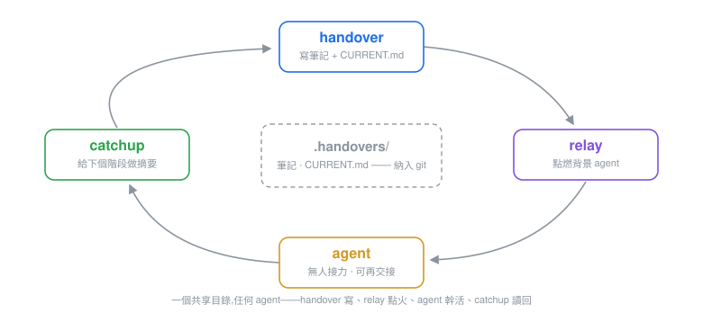

# quiver

> 一箭一技。🏹
> **小巧、鋒利、獨立——每個 agent,同一套箭。**

[](https://github.com/dudupii/quiver/actions/workflows/check.yml)
[](https://github.com/dudupii/quiver/releases)
[](./LICENSE)
[](https://github.com/dudupii/quiver/stargazers)

[English](README.md) · [简体中文](README.zh-Hans.md) · [繁體中文](README.zh-Hant.md) · [日本語](README.ja.md)

<p align="center"></p>

一個持續擴充的 AI 編碼 agent 技能箭袋——支援 [Claude Code](https://claude.com/claude-code)、[Codex](https://developers.openai.com/codex/)、[pi](https://pi.dev/)、[PrimeAgent](https://github.com/PrimeIntellect-ai/prime-agent)(以及一切相容 pi 套件格式的 agent)。每支箭都小巧、鋒利、獨立——需要哪支拔哪支。

單一技能源 + 各 agent 薄配接:所有 agent 從同一個儲存庫獲得同一套箭。

多數技能包交付的是一套框架——工作階段鉤子、分階段工作流、給每件事都裹一層流程。quiver 反其道而行:一支箭就是一份 SKILL.md——至多幾 KB,沒有鉤子,也不依賴 agent 自帶機制之外的任何東西。常駐開銷只有幾十 token 的技能列表;其餘一切,等你開弓才發生。

## 箭囊

| 技能 | 作用 |
|---|---|
| **brainstorm** | 在任何實作開始**之前**,把模糊想法自動對齊成共識設計。創造性工作開始時自動觸發。 |
| **handover** | 多語言工作階段交接筆記(英/日/中),帶語言記憶——決策、放棄的選項與理由、踩坑、下一步、建議技能——外加當前狀態檔案 `CURRENT.md`:每事實一行,隨筆記累積持續保鮮。 |
| **catchup** | 讀取最近的交接筆記(外加最後一次交接之後的提交),四段式摘要帶你恢復上下文。純唯讀,可安全自動觸發。 |
| **relay** | 把最新交接筆記交給全新背景 agent 無人值守接棒——指標種子、描述性名稱、回顯命令。僅限使用者主動觸發。 |

更多箭支在路上。

## 安裝

**Claude Code**

```bash
claude plugin marketplace add dudupii/quiver
claude plugin install quiver@quiver
```

所有箭一起安裝,統一掛在 `/quiver:` 命名空間下——裸名 `/brainstorm`、`/handover` 也能用。

**Codex**

```bash
codex plugin marketplace add dudupii/quiver
codex plugin add quiver@quiver
```

技能以 `quiver:brainstorm`、`quiver:catchup`、`quiver:grilling` 出現在工作階段技能目錄;`handover` 與 `relay` 有意不出現在自動目錄裡(只在你明確要求時觸發)。

**pi**

```bash
pi install git:github.com/dudupii/quiver
```

可用 `pi install git:github.com/dudupii/quiver@v0.5.0` 錨定版本。

**PrimeAgent**(建構於 pi 之上,同套件格式)

```bash
prime-agent package install git:github.com/dudupii/quiver
```

## 更新

| Agent | 命令 |
|---|---|
| Claude Code | `claude plugin update quiver`——重啟工作階段生效;版本沒變先重新整理 marketplace(`claude plugin marketplace update quiver`) |
| Codex | `codex plugin marketplace upgrade quiver`,再 `codex plugin add quiver@quiver` 重裝 |
| pi | `pi update` |
| PrimeAgent | `prime-agent package update` |

## 箭支詳解:handover

工作階段收尾時生成的交接筆記,給人(或下個工作階段)接手用。

- **8 個固定小節**,最重要的是「放棄的選項與理由」——防止下個工作階段重新討論已定案的問題
- **只引用不重複**:已落在 spec/plan/ADR/issue/commit/diff/早期交接裡的內容,一律引用路徑,絕不複述
- **建議技能**節:點名下個工作階段該調哪些 skill、用來做什麼
- **脫敏**:筆記中不出現 API key、token、密碼、個人資料——每次寫入前跑一遍憑證特徵機械掃描
- **語言**:`/quiver:handover` 自動從你的訊息推斷(回退英文);`/quiver:handover ja`、`/quiver:handover zh` 明確指定——裸名 `/handover` 也可。明確選擇按專案記憶在 `.handovers/.lang`,下次自動沿用
- **焦點**:語言 token 之後的全部參數——或參數不以語言開頭時的整段——告訴筆記下個工作階段要主攻什麼(`/quiver:handover zh 收尾發布`、`/handover 修復登入 bug`)。只調詳略、不做取捨:八段結構照寫,被聚焦的線索寫深、佔下一步首位,其餘收斂到要點
- 筆記落在 `.handovers/YYYY-MM-DD_HHmm.md`(重名加 `_2`、`_3`…),開頭帶 YAML frontmatter:`author`(僅 git `user.name`,絕不寫 email)、`branch`、`commit`、`lang`,以及鏈向上一篇的 `continues:`。取不到的欄位靜默省略;舊格式筆記照常有效
- **僅限使用者主動觸發**:handover 絕不自行啟動——工作階段結束本身不是觸發條件,必須有人明確要求
- **舊路徑**:v0.4.0 之前的筆記在 `.claude/handovers/`——仍然可讀(`continues`、catchup、語言記憶都會讀它)但絕不改寫;新筆記一律寫 `.handovers/`
- **當前狀態檔案**:寫筆記的同時,handover 維護 `.handovers/CURRENT.md`——每條持久事實一行、只存最新態,帶確認日期與來源筆記。每次執行只落本工作階段學到的東西:新近固化的加入、真值變化的就地取代(條目只陳述新事實——舊值留在 git 和來源筆記裡)、被推翻的刪除,本工作階段未觸碰的條目絕不改寫;有筆記但無該檔案的儲存庫首次執行會回掃全部歷史建立它——從最舊的筆記掃起,被時間掩埋的事實不會被近況擠掉
- **收尾回執**:handover 的收尾回覆就是回執——筆記路徑、寫入的元資料鏈(遵循筆記自身的 frontmatter 規則)、以及 `CURRENT.md` 的變動結果,每條變更一行;首次建立則以條目數開頭、逐條列出新增。任何寫入都不會無聲發生
- **感知 git、但唯讀 git**:交接目錄被 git 追蹤時,結尾附一句「提交這篇筆記讓隊友看到」;被忽略或未追蹤時對 git 隻字不提。絕不執行任何改變 git 狀態的命令

## 箭支詳解:catchup

handover 的讀取側。`/quiver:catchup`(裸名 `/catchup` 也可)讀取最近的交接筆記——預設 3 篇,傳數字可加寬(`/catchup 5`)——以四段式摘要作答:**當前狀態 / 待辦線索與下一步 / 仍有效的踩坑記錄 / 建議行動**。當最新筆記記錄了 `commit`,摘要還會折入該提交之後的 git log,「最後一次交接之後發生了什麼」一條命令回答。當 `.handovers/CURRENT.md` 存在時,catchup 先讀它——每條持久事實連確認日期一起呈現——再讀與最新筆記同日期的全部筆記(同日並行交接一併覆蓋);沒有該檔案時,預設 3 篇視窗照舊。

它允許模型自動觸發——新工作階段接手一個有交接筆記的專案時可自行啟動——因為它嚴格唯讀:不寫任何檔案,連語言記憶都不碰。無 frontmatter 的舊格式筆記照常讀取。

## 箭支詳解:relay

handover 的點火側。`/quiver:relay [焦點]`(裸名 `/relay` 也可)把**最新**交接筆記交給本機一個全新背景 agent:種子是指標——「讀這篇筆記、跑 catchup、主攻這條線索」——絕不是筆記的拷貝。agent 以描述性名稱(從焦點或筆記最高優先級下一步派生)在當前工作目錄啟動,任務列表和終端標題裡一眼可辨;確切的啟動命令會回顯在回覆裡。可選焦點指定接棒線索;預設取筆記最高優先級的下一步。

- **僅限使用者主動觸發**——拉起背景程序是副作用,relay 絕不自行啟動;顯式專屬措辭寫在每平台都會讀的技能描述裡,並在各配接策略中宣告
- **零寫入**:筆記位元組不變(含 `.lang`)、git 唯讀——點火是 relay 唯一的副作用
- **沒有筆記?** relay 拒絕並指向 `/quiver:handover`——絕不憑空編造種子
- **平台支援**——逐平台對照其自有 CLI 與文件核實;平台沒有機制時如實說明,絕不假裝點火:

  | 平台 | 背景機制 | relay 的做法 |
  |---|---|---|
  | Claude Code | 原生(`claude --bg`) | 直接點火;任務列表裡管理 |
  | Codex CLI | 本地沒有——`exec` 是前景執行;`queue` 只餵既有工作階段、`agents` 只能瀏覽 | 如實說明;把種子交給你去第二個終端跑,或在你使用 Codex Cloud 時給出實驗性的 `codex cloud exec` |
  | pi | 核心刻意不做——官方文件指路「經 tmux 再起 pi 實例」 | 經 tmux 再起一個 pi(`pi -p`),或遵從已安裝的子代理擴充 |
  | PrimeAgent | 原生——daemon 支撐的常駐工作階段 | 經 `rlm.create_session` 起常駐工作階段;用 `prime-agent agents` 管理 |
- 它補全的閉環:handover 寫 → relay 點火無人值守 → agent 幹活(可再寫交接)→ catchup 讀取成果

## 團隊工作流

交接目錄就是共享介質:

1. **把 `.handovers/` 納入 git 追蹤。**所有人的工作階段都往同一目錄寫筆記——無論用哪個 agent(Claude Code、Codex、pi…)。handover 察覺目錄被追蹤後,會建議提交每篇新筆記——只有一句建議;技能本身絕不碰 git 狀態。
2. **約定一種筆記語言。**`.handovers/.lang` 是每個專案一個的共享值(後寫覆蓋)。用 `/quiver:handover zh`(或 `ja`/`en`)設一次,所有人的筆記隨之統一。
3. **工作階段開頭跑 `/quiver:catchup`。**最近的筆記加上最新一篇之後的提交——一條命令恢復上下文,不盲信過時資訊。

## 箭支詳解:brainstorm

`superpowers:brainstorming` 的輕量替代:沒有重型流程框架、沒有工作階段啟動鉤子、不強制每件事都走流程。一個入口技能 + 一個訪談引擎,總共約 2KB 指令。

### 工作原理

1. **發散階段**(按需觸發)——遇到方向級決策(新子系統、外部依賴選型、資料模型、同步 vs 非同步),或你主動要方案時,先給出 2–3 個整體方案及權衡與推薦,然後**等你選方向**。
2. **收斂階段**——呼叫 [grilling](https://github.com/mattpocock/skills)(已捆綁,MIT):設計樹式訪談,按依賴順序分輪批次提問、每題附推薦答案,且絕不問它自己能查到的事。
3. **門控**——對齊完成後給你設計摘要(各決策的備選/所選/理由 + 未決假設清單),**你不放行就不動程式碼**。

### 用法

```
我想給日誌系統加個告警規則引擎          ← 自動觸發
快取方案給我 2-3 個對比一下            ← 強制發散階段
先對齊一下:給 CLI 加 OAuth 登入         ← 明確觸發
```

如果同時安裝了 [mattpocock skills](https://github.com/mattpocock/skills),後續自然銜接 `/to-spec` → `/to-tickets` → `/implement`,技能會在可用時主動提示。

### 與 superpowers:brainstorming 的對比

| | superpowers:brainstorming | quiver/brainstorm |
|---|---|---|
| 觸發 | 每個創造性任務前強制 | 自動但分重量;方向級才發散 |
| 提問 | 一次一問 | 設計樹分輪、依賴排序、每題帶推薦 |
| 方案對比 | 固定 2-3 個 | 方向級或你要求時 |
| 常駐開銷 | 框架整體 ~741 token/工作階段 | 列表約 60 token,不觸發不付費 |
| 硬門 | 技能內提示詞約束 | 人守門;配合原生 plan mode 可獲得 harness 級硬門 |

## 致謝與授權

- `skills/grilling/` 下捆綁的 `grilling` 引擎來自 Matt Pocock 的 [mattpocock/skills](https://github.com/mattpocock/skills)(MIT),見 [THIRD_PARTY_NOTICES.md](THIRD_PARTY_NOTICES.md)。
- 其餘部分:MIT © 2026 dudupii,見 [LICENSE](LICENSE)。
